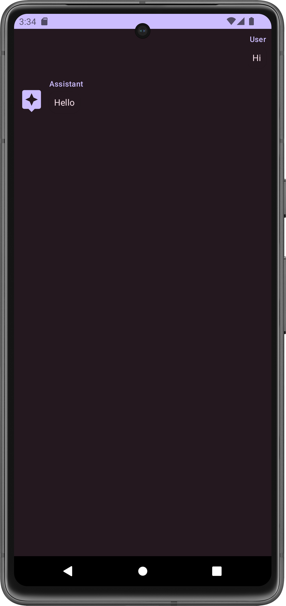

### Week 2 (Nov. 20)
Added OpenAI Chat API, TextToSpeech, and SpeechRecognizer functionality. The OpenAI API is sometimes very slow, as you can see in the video. The Android emulator doesn't have a microphone so you'll just have to trust me when I say that the speech recognition works.

<video height=700 controls>
  <source src="videos/week2.webm" type="video/webm">
</video>

### Week 1 (Nov. 13)
Created a simple messaging screen by following the [Android Jetpack Compose tutorial](https://developer.android.com/jetpack/compose/tutorial). I chose to use Compose because I saw Google pushing it a ton on the Android developer website. It must be good, right? So far I think it looks really nice with minimal configuration, and it's nice not to have to deal with a ton of XML tags.

(this is just a preview of what the screen looks like, not an actual conversation with GPT)
